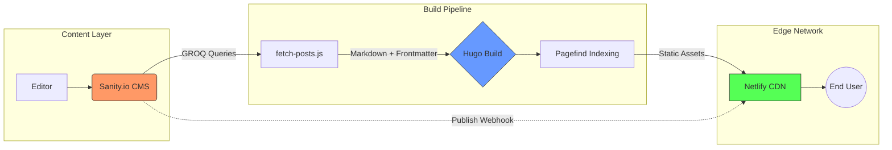

# Mind the Lines

A high-performance, minimalist editorial platform. Architected as a Jamstack solution prioritizing static delivery, semantic search, and editorial flexibility.

[](https://github.com/Kartik199/mind-the-lines/releases/tag/v1.5.0)

## 1. Technical Philosophy
The architecture follows a **Static-First, Minimal-JS** philosophy. The goal is to provide a "paper-like" reading experience with sub-second latency and zero unnecessary client-side overhead. Designed for performance-first principles: decoupling content from presentation, leveraging CDNs for global distribution, and minimizing runtime dependencies.

## 2. Technologies
- **Static Site Generator**: Hugo for build-time rendering and content processing.
- **Headless CMS**: Sanity.io with GROQ queries for structured content retrieval.
- **Styling**: TailwindCSS for utility-first CSS, processed via PostCSS with custom theme variables (e.g., paper/ink color scheme, Lora serif font).
- **Search**: Pagefind for lightweight, client-side indexing with weighted ranking.
- **Build Tools**: Node.js for data fetching; PostCSS for CSS optimization.
- **Deployment**: Netlify for automated builds and CDN distribution.

## 3. System Architecture: The Jamstack Pipeline

This platform utilizes a decoupled architecture to balance editorial flexibility with production performance.



### 3.1 Headless Content Management (Sanity.io)
- **Structured Content:** Utilizing Sanity's GROQ (Graph-Relational Object Queries) to fetch deeply nested editorial data.
- **Schemas**: Posts include title, slug, published date, summary, categories (referencing category documents), hero image, and rich body content (portable text blocks, images, YouTube embeds, inline quotes with styles).
- **Image Optimization:** Leveraging Sanity's Asset Pipeline to serve transformed, CDN-cached images with auto-formatting. Hero images are pre-built at three widths (800w / 1200w / 1600w) at fetch time, written into frontmatter as `srcset` strings, and delivered to templates with `fetchpriority="high"` and `<link rel="preload">` for optimal LCP.
- **Publish Webhook:** Content published in Sanity automatically triggers a Netlify rebuild via a configured build hook, keeping the live site in sync without requiring a code push.

### 3.2 Static Site Generation (Hugo)
- **Build-time Integration:** Sanity data is consumed during the build process via `fetch-posts.js`, a custom Node.js script that converts GROQ results to Hugo-compatible Markdown with YAML frontmatter.
- **Zero-Client-Side Fetching:** By baking CMS data into the static build, we eliminate "Loading Spinner" UX and reduce API overhead at runtime.
- **Configuration:** Category taxonomy, custom permalinks, and Goldmark renderer with unsafe HTML enabled for rich content blocks.

### 3.3 Search & Discovery (Pagefind)
- **Post-build Indexing:** After Hugo generates the site, Pagefind crawls the static files to create a lightweight search index (<10KB).
- **Intent-based Asset Loading:** Search CSS/JS assets are only injected into the DOM upon user interaction (shortcut `/` or click), ensuring the initial page load remains ultra-lean.
- **Weighted Ranking:** Article headers are weighted (x10) over body content to ensure precision in search results.

## Performance Baseline (v1.5.0)
Measured 2026-06-08 via Lighthouse CLI against a local production build (`npm run build`). Lighthouse uses simulated throttling (4G mobile); LCP is dominated by hero images fetched from the Sanity CDN over the network and will be lower in production.

| Metric | Homepage | Single post |
|---|---|---|
| Performance score | 92 | 86 |
| First Contentful Paint | 1.7 s | 3.2 s |
| Largest Contentful Paint | 3.2 s | 3.2 s |
| Total Blocking Time | 0 ms | 0 ms |
| Cumulative Layout Shift | 0 | 0 |
| Speed Index | 1.7 s | 3.2 s |

**Search:**
- Search index content (fragment + index data): ~40 KB for 5 posts — scales linearly with content
- Pagefind runtime (UI + WASM): ~400 KB, lazy-loaded on first search open
- Search latency: sub-100ms after index is loaded (client-side, O(1) retrieval)

## Content Features
- **Rich Text**: Portable text with headings (h1–h6), inline marks (bold, italic, code, underline, strikethrough), and hyperlinks.
- **Media**: Hero images, inline images with captions/alt text, and YouTube video embeds via shortcodes.
- **Editorial Elements**: Pull quotes (editorial/left/right styles) with author citations.
- **Taxonomies**: Categories for organization, with navigation dropdowns and pagination.

## Design System
- **Blinded UI Pattern:** A custom-engineered modal system for navigation and search that physically hides the main content to eliminate visual ghosting and focus user attention.
- **Typography-First:** Minimalist aesthetic using serif-heavy editorial styles to mirror editorial literature. Includes drop cap on article openers and scroll-reveal animations on paragraphs and media.
- **Custom Theme:** TailwindCSS extended with semantic color variables (paper, ink, muted) and Lora font for readability.

## 4. Local Development
### Prerequisites
- Node.js 20+, Hugo 0.145.0+
- Sanity API token and project ID (configure in `.env`)

### Environment Variables
Create a `.env` file at the project root:
```
SANITY_PROJECT_ID=your_project_id
SANITY_DATASET=production
SANITY_API_TOKEN=your_api_token
```

### Commands
```bash
# Clone the repo
git clone https://github.com/Kartik199/mind-the-lines.git

# Install dependencies
npm install

# Run Hugo development server
npm run dev

# Build and re-index search
npm run build
```

## 5. Deployment
Configured for Netlify with automated builds triggered on every git push and on Sanity content publish events (via webhook). Publish directory: `public/`. Environment variables include Hugo and Node versions for build consistency. The static-first approach ensures global CDN distribution with minimal server overhead.
