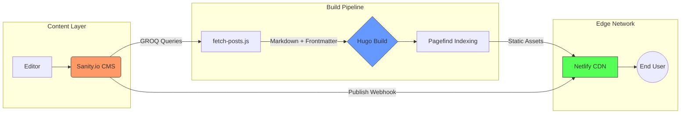

# Hugo Editorial

A high-performance, minimalist editorial platform. Architected as a Jamstack solution prioritizing static delivery, semantic search, and editorial flexibility.

## 1. Technical Philosophy
The architecture follows a **Static-First, Minimal-JS** philosophy. The goal is to provide a "paper-like" reading experience with sub-second latency and zero unnecessary client-side overhead. Designed for performance-first principles: decoupling content from presentation, leveraging CDNs for global distribution, and minimizing runtime dependencies.

## 2. Technologies
- **Static Site Generator**: Hugo for build-time rendering and content processing.
- **Headless CMS**: Sanity.io with GROQ queries for structured content retrieval.
- **Styling**: TailwindCSS v4 with a token-based design system declared in CSS (`@theme`) — semantic paper/ink/muted colors, hairline and wash surfaces derived via `color-mix`, and a typographic label scale.
- **Typography**: Lora variable font (400–700, upright + italic), self-hosted and preloaded — no third-party font requests on the critical path.
- **Theming**: Light and dark themes from a single token set. Dark mode is a warm "lamplight" inversion of the paper palette, toggled via a sun/moon button, persisted in `localStorage`, and defaulting to the visitor's OS preference with no flash on load.
- **Search**: Pagefind for lightweight, client-side indexing with weighted ranking.
- **Build Tools**: Node.js for data fetching; PostCSS for CSS optimization.
- **Deployment**: Netlify for automated builds and CDN distribution.

## 3. System Architecture: The Jamstack Pipeline

This platform utilizes a decoupled architecture to balance editorial flexibility with production performance.



### 3.1 Headless Content Management (Sanity.io)
- **Structured Content:** Utilizing Sanity's GROQ (Graph-Relational Object Queries) to fetch deeply nested editorial data.
- **Schemas**: Posts include title, slug, published date, summary, categories (referencing category documents), hero image, and rich body content (portable text blocks, lists, images, YouTube embeds, inline quotes with styles).
- **Image Optimization:** Leveraging Sanity's Asset Pipeline to serve transformed, CDN-cached images with auto-formatting. Hero images are pre-built at three widths (800w / 1200w / 1600w) at fetch time, written into frontmatter as `srcset` strings, and delivered to templates with `fetchpriority="high"` and `<link rel="preload">` for optimal LCP.
- **Generated Content:** `content/posts/*.md` is produced by `fetch-posts.js` on every build and is git-ignored — Sanity is the single source of truth. Unpublishing a post in Sanity removes its file on the next build (stale-file cleanup).
- **Publish Webhook:** A Sanity publish webhook triggers a Netlify build hook on content publish — new posts deploy automatically without a code push.

### 3.2 Static Site Generation (Hugo)
- **Build-time Integration:** Sanity data is consumed during the build process via `fetch-posts.js`, a custom Node.js script that converts GROQ results to Hugo-compatible Markdown with YAML frontmatter.
- **Zero-Client-Side Fetching:** By baking CMS data into the static build, we eliminate "Loading Spinner" UX and reduce API overhead at runtime.
- **Configuration:** Category taxonomy, custom permalinks, and Goldmark renderer with unsafe HTML enabled for rich content blocks. `baseURL` is `/` locally for dev stability and is overridden at deploy time with Netlify's `$URL`.

### 3.3 Search & Discovery (Pagefind)
- **Post-build Indexing:** After Hugo generates the site, Pagefind crawls the static files to create a lightweight search index (<10KB).
- **Intent-based Asset Loading:** Search CSS/JS assets are only injected into the DOM upon user interaction (shortcut `/` or click), ensuring the initial page load remains ultra-lean.
- **Weighted Ranking:** Article headers are weighted (x10) over body content to ensure precision in search results.
- **Native Theming:** Results are restyled through Pagefind's CSS custom properties to match the site's serif/paper design system in both light and dark themes.

## Performance Baseline (v1.5.0+)
"After" measured 2026-06-15 via Lighthouse (simulated 4G mobile throttling) against the **live Netlify production deployment**. "Before" is a local production build prior to self-hosting fonts; the gain comes from removing the render-blocking two-origin Google Fonts chain.

| Metric | Before (local, pre-fonts) | After — Home (prod) | After — Article (prod) |
|---|---|---|---|
| Performance score | 77–78 | **99** | **98** |
| First Contentful Paint | 3.5 s | **1.3 s** | **1.2 s** |
| Largest Contentful Paint | 4.0–4.1 s | **2.1 s** | **2.3 s** |
| Speed Index | 4.6 s | **2.4 s** | **2.8 s** |
| Total Blocking Time | 0 ms | 10 ms | 0 ms |
| Cumulative Layout Shift | 0 | 0 | 0 |

These are now confirmed on the production CDN, not just a local lab build.

**Search:**
- Search index content (fragment + index data): ~40 KB for 5 posts — scales linearly with content
- Pagefind runtime (UI + WASM): ~400 KB, lazy-loaded on first search open
- Search latency: sub-100ms after index is loaded (client-side, O(1) retrieval)

## Content Features
- **Rich Text**: Portable text with headings (h1–h6), bullet/numbered lists, inline marks (bold, italic, code, underline, strikethrough), and hyperlinks — all styled by a dedicated prose type ramp.
- **Media**: Hero images, inline images with captions/alt text and a keyboard-accessible lightbox, and YouTube video embeds via shortcodes.
- **Editorial Elements**: Pull quotes (editorial/left/right styles) with author citations; drop caps on article openers (automatically suppressed when an article opens with a quotation mark).
- **Taxonomies**: Categories for organization, with navigation dropdowns and pagination.

## Design System
- **Token-Based Theming:** All colors, hairlines, washes, shadows, and label typography are CSS custom properties in Tailwind's `@theme`. Dark mode is implemented by overriding the tokens under `[data-theme="dark"]` — zero duplicate dark classes in templates.
- **Blinded UI Pattern:** A custom-engineered modal system for navigation and search that physically hides the main content to eliminate visual ghosting and focus user attention.
- **Typography-First:** Minimalist aesthetic using serif-heavy editorial styles to mirror editorial literature. Includes drop cap on article openers and scroll-reveal animations on paragraphs and media.
- **Accessible by Default:** Content renders without JavaScript, all motion honors `prefers-reduced-motion`, secondary text meets WCAG AA contrast in both themes, and interactive elements have visible focus states and keyboard paths (including the categories dropdown and lightbox).

## 4. Local Development
### Prerequisites
- Node.js 20+, Hugo 0.145.0+
- Sanity API token and project ID (configure in `.env`)

### Configuration
Copy the example config and fill in your details:
```
cp hugo.toml.example hugo.toml
```
Edit `hugo.toml`: set `title`, `tagline`, `description`, and `author`. Place your OG image at `static/images/og-default.jpg`.

### Environment Variables
Create a `.env` file at the project root:
```
SANITY_PROJECT_ID=your_project_id
SANITY_DATASET=production
SANITY_API_TOKEN=your_api_token
```

### Commands
```bash
# Clone the repo
git clone https://github.com/your-username/your-repo-name.git

# Install dependencies
npm install

# Run Hugo development server
npm run dev

# Build and re-index search
npm run build
```

Note: search in dev serves the index from the last `npm run build` (Pagefind doesn't run in dev mode) — run a build first if search 404s.

## 5. Deployment
Configured for Netlify with automated builds triggered on every git push and on Sanity content publish (via Sanity → Netlify build hook webhook). Publish directory: `public/`. Environment variables pin Hugo and Node versions for build consistency, and security headers (`X-Frame-Options`, `X-Content-Type-Options`, `Referrer-Policy`, `Permissions-Policy`) are applied to all routes via `netlify.toml`. The static-first approach ensures global CDN distribution with minimal server overhead.
